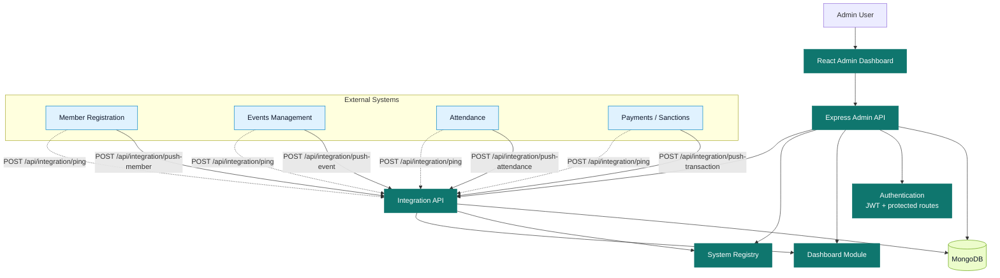
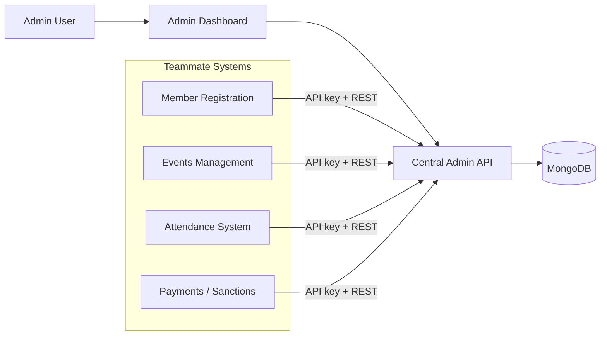

# System Architecture

## Overview

The School Organization Management Ecosystem uses a central admin dashboard as the single source of truth for monitoring and reporting. The teammate systems are independent sub-systems that send data to the admin backend through secured REST endpoints. Each sub-system authenticates with an API key and pushes updates to the central platform, which stores the activity in MongoDB and displays it in the dashboard.

## Architecture Diagram

### Presentation Diagram

Use this version when you want a cleaner slide-ready layout with the same logic:

## Core Components

- Authentication Layer: JWT-based login and protected routes
- Dashboard Layer: stats, charts, recent activity, reports
- System Layer: registration and status tracking for connected modules
- Integration Layer: API-key-authenticated endpoints for incoming data
- Data Layer: MongoDB collections for users, systems, transactions, and logs

## Where To Place Each Teammate System

Put each teammate system in the **External Sub-systems** block, not inside the admin dashboard.

- Member Registration System: external module that calls `/api/integration/push-member`
- Events Management System: external module that calls `/api/integration/push-event`
- Attendance System: external module that calls `/api/integration/push-attendance`
- Payments / Sanctions System: external module that calls `/api/integration/push-transaction`

Each one should also call `/api/integration/ping` when it starts so the admin dashboard can mark it as online.

## Recommended Diagram Meaning

- React Admin Dashboard: the interface used by the admin user
- Express Admin API: the server that receives both dashboard requests and subsystem requests
- System Registry: stores connected subsystem records, their API keys, status, and last seen time
- Integration API: receives data from teammate systems and writes logs and records to MongoDB
- MongoDB: stores members, events, attendance, transactions, logs, and system metadata

## Thesis / Defense Explanation

The architecture follows a centralized client-server model. The admin dashboard is the main interface used by the administrator, while the teammate projects operate as independent sub-systems that communicate with the central admin backend through secured REST endpoints. Each sub-system authenticates using an API key, sends its data to the integration API, and can announce its online status through a ping request.

This design keeps the modules decoupled while still allowing the school organization ecosystem to work as one platform. The admin backend stores all incoming records in MongoDB, maintains system status, writes integration logs, and exposes dashboard data for monitoring and reporting. In short, the member registration, events management, attendance, and payments/sanctions systems are external service modules that feed data into one central administration layer.

## Integration Flow

1. A sub-system sends a ping or data payload to the integration endpoint.
2. The API validates the incoming API key.
3. The admin system writes an integration log entry.
4. Relevant business data is persisted in MongoDB.
5. The admin dashboard fetches updated data and displays it to the user.

## Suggested Presentation Order In Your Final Architecture

If you redraw the diagram for your documentation or defense, use this order from left to right:

1. Admin User
2. React Admin Dashboard
3. Express Admin API
4. MongoDB
5. External Sub-systems grouped below or beside the API, each pointing to the Integration API

This makes it clear that the teammate systems are not separate copies of the dashboard. They are client systems that feed data into the central admin platform.
