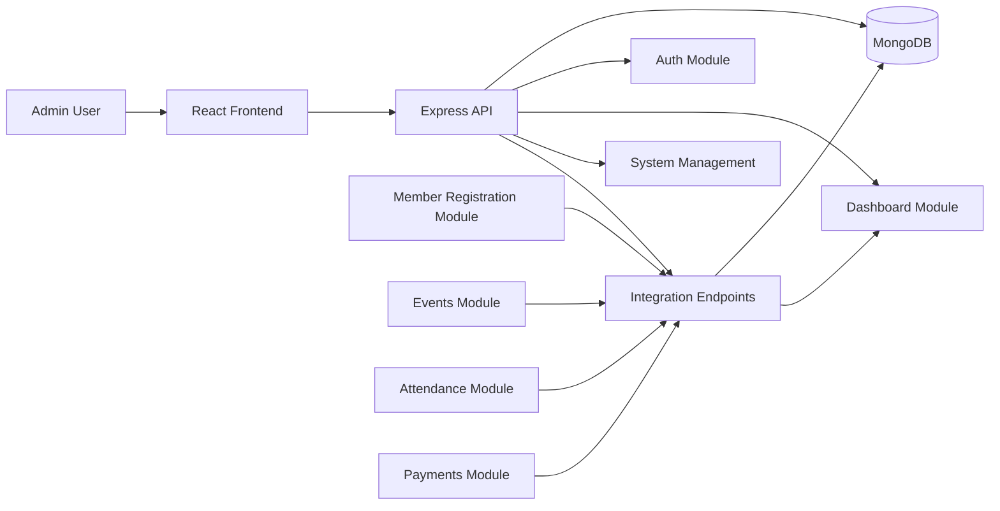

# System Architecture

## Overview

The School Organization Management Ecosystem uses a central admin dashboard that receives data from independent sub-systems through secured REST endpoints. Each sub-system authenticates with an API key and pushes updates to the central platform, which stores the activity in MongoDB and displays it in the dashboard.

## Architecture Diagram

## Core Components

- Authentication Layer: JWT-based login and protected routes
- Dashboard Layer: stats, charts, recent activity, reports
- System Layer: registration and status tracking for connected modules
- Integration Layer: API-key-authenticated endpoints for incoming data
- Data Layer: MongoDB collections for users, systems, transactions, and logs

## Integration Flow

1. A sub-system sends a ping or data payload to the integration endpoint.
2. The API validates the incoming API key.
3. The admin system writes an integration log entry.
4. Relevant business data is persisted in MongoDB.
5. The admin dashboard fetches updated data and displays it to the user.
