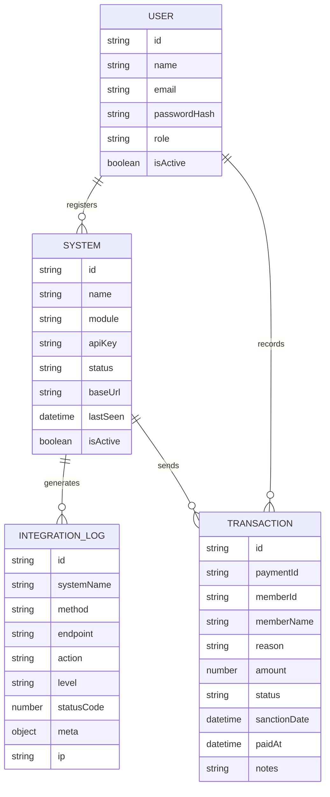

# MongoDB ERD

```mermaid
erDiagram
    USER ||--o{ SYSTEM : registers
    USER ||--o{ TRANSACTION : records
    SYSTEM ||--o{ INTEGRATION_LOG : generates
    SYSTEM ||--o{ TRANSACTION : sends

    USER {
      string id
      string name
      string email
      string passwordHash
      string role
      boolean isActive
    }

    SYSTEM {
      string id
      string name
      string module
      string apiKey
      string status
      string baseUrl
      datetime lastSeen
      boolean isActive
    }

    TRANSACTION {
      string id
      string paymentId
      string memberId
      string memberName
      string reason
      number amount
      string status
      datetime sanctionDate
      datetime paidAt
      string notes
    }

    INTEGRATION_LOG {
      string id
      string systemName
      string method
      string endpoint
      string action
      string level
      number statusCode
      object meta
      string ip
    }
```

## Relationships

- A user can register many systems.
- A system can generate many integration logs.
- A system can send many transactions.
- A user can record many transactions.
